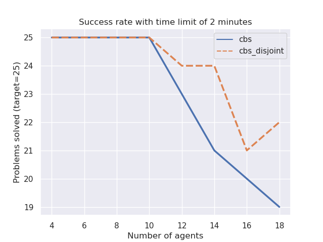
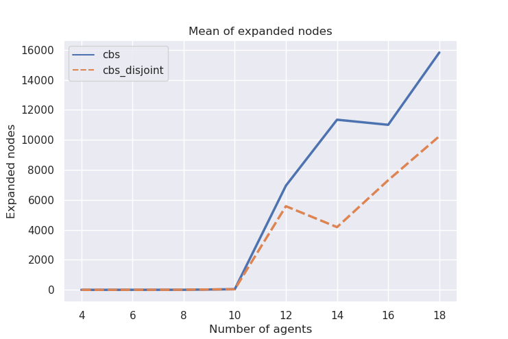

# Multi-Agent Path Finding (MAPF)
本项目基于南加州大学（University of Southern California）的课程项目 [Multi-Agent Path Finding](https://idm-lab.org/project-p/project.html)

## Run experiments

### CBS

```shell
python run_experiments.py --solver CBS --instance <map_file>
```

### WCBS

```shell
python run_experiments.py --solver WCBS --instance <map_file> --windowsize <window_size,default=3>
```

### DWCBS

```shell
python run_experiments.py --solver DWCBS --instance <map_file> --train <train_flag>
```


<p align="center">
    
</p>


#### 1 - Benchmark random
The benchmark is based on random maps generated at runtime with a number of agents that varies from 4 to 18 with a step of 2. For each number of agents the benchmark generate 25 maps and solve them with the MAPF solver. The time limit is set to 2 minutes and every cell of the map has the probability of 5% of being occupied.
The benchmark is executed with the following command (it can take hours to finish):
```bash
python run_experiments.py --benchmark random
```
After the execution you can see the results in the following command:
```bash
python plot_benchmark.py --plot random
```
A possible output is the following:
<p align="center">
    
    
    
</p>

#### 2 - Benchmark success
In this benchmark the map is a 20x20 matrix with obstacles distributed in the 5% of the map. The idea is to increase the number of agents (from 4 to 26 with step 2) and see if the algoritm can solve the problem in less than 5 minutes. For each number of agents the same map is used for 25 times, but the start and goal positions are randomly distributed (idea taken from this [paper](http://idm-lab.org/bib/abstracts/papers/icaps19a.pdf)).
To run this benchmark you need to launch the following command:

```bash
python run_experiments.py --benchmark success
```
When the benchmark is finished (it can take more then one hour) you can see the plots by typing the following command:
```bash
python plot_benchmark.py --plot success
```
<p align="center">
    
    
</p>

### Conclusion
As plotted, the algorithm CBS-DS runs much faster than the CBS algorithm and the number of nodes expanded is smaller. So the benchmark verified that the CBS-DS algorithm seems to be more efficient than the CBS as written on the assignment "...CBS with disjoint splitting can be expected to run faster than CBS" ([handout.pdf](pdf/handout.pdf)).
